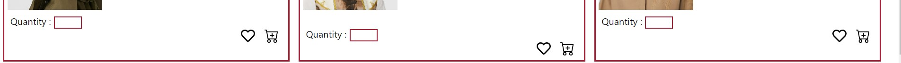

<a name="readme-top"></a>

<!-- PROJECT LOGO -->
<br />
<div align="center">
    


<h3 align="center">Sunglasses Online Website</h3>

</div><br>


<!-- TABLE OF CONTENTS -->
<details>
  <summary>Table of Contents</summary>
  <ol>
    <li>
      <a href="#about-the-project">About The Project</a>
      <ul>
        <li><a href="#built-with">Built With</a></li>
      </ul>
    </li>
    <li>
      <a href="#getting-started">Getting Started</a>
      <ul>
        <li><a href="#prerequisites">Prerequisites</a></li>
        <li><a href="#installation">Installation</a></li>
      </ul>
    </li>
    <li><a href="#usage">Usage</a></li>
    <li><a href="#contact">Contact</a></li>
    <li><a href="#acknowledgments">Acknowledgments</a></li>
  </ol>
</details>


<!-- ABOUT THE PROJECT -->
## About The Project

<div>
    <br>
    <br>
    <br>

</div>

I like to wear sunglasses , because it  completes the look and makes it perfect . So I decided to build an online website that contains a collection of my favorite sunglasses from my favorite brand BURBERRY 
, I like to buy sunglasses from  this brand because it suits every woman's styles. 

<p align="right">(<a href="#readme-top">back to top</a>)</p>


### Built With
In this project we used the spring boot framework because it reduces lots of development time and increases productivity.
<br>

<div>
  <li>  </li></div>
<br>

also we used java language because it is easy to use and is therefore easy to write, compile, debug, and learn more than other programming languages.

<div>
  <li>  </li></div>


<p align="right">(<a href="#readme-top">back to top</a>)</p>


<!-- GETTING STARTED -->
## Getting Started

This is an example of how you may give instructions on setting up your project locally.
To get a local copy up and running follow these simple example steps.

### Prerequisites

1. Download the free version of IntelliJ IDEA called  - Community Edition

[![IntelliJ IDEA][IntelliJIDEA.com]][IntelliJIDEA-url]

2. download the JDK  [JDK-11][jdk11-url]
   <br><br>
3. In the build.gradle file add the following implementations:
   * implementation 'org.springframework.boot:spring-boot-starter'
   * implementation 'org.springframework.boot:spring-boot-starter-web'
   * implementation 'org.springframework.boot:spring-boot-starter-actuator'<br><br>

4. To view the database you can open the [H2-console][H2console-url]

### Installation

Below is an example of how you can installing the project.

1. copy this link : [https://github.com/AdanHasan/Shopping-Website-java.git](https://github.com/AdanHasan/Shopping-Website-java.git)
2. Clone the repository 
   ```sh
   git clone https://github.com/AdanHasan/Shopping-Website-java.git
   ```


<p align="right">(<a href="#readme-top">back to top</a>)</p>


<!-- USAGE EXAMPLES -->
## Usage

We wrote the code in many files to save the data in H2-database and display it as a columns and rows into tables , it is important to know that all files are related to each other , each file contains an important part from the code that we can not display the data correctly and properly without it. 

<p align="right">(<a href="#readme-top">back to top</a>)</p>


<!-- CONTACT -->
## Contact

My Name : Adan Hasan <br>
My Email : adan2004hasan@gmail.com

Project Link: [https://github.com/AdanHasan/Shopping-Website-java](https://github.com/AdanHasan/Shopping-Website-java)

<p align="right">(<a href="#readme-top">back to top</a>)</p>


<!-- ACKNOWLEDGMENTS -->
## Acknowledgments

 List of resources we find helpful and would like to give credit to. 

* [baeldung](https://www.baeldung.com/spring-boot-h2-database)
* [GitHub Pages](https://pages.github.com)
* Finally I want to thank my teacher ben meir about the effecient github repositories , [click her if you want to browse his github pages](https://github.com/benmeirr)


<p align="right">(<a href="#readme-top">back to top</a>)</p>


[IntelliJIDEA.com]: https://img.shields.io/badge/IntelliJIDEA-000000.svg?style=for-the-badge&logo=intellij-idea&logoColor=white
[IntelliJIDEA-url]: https://www.jetbrains.com/idea/download/?source=google&medium=cpc&campaign=9730674410&term=intellij%20idea&content=602143185274&gclid=Cj0KCQiApKagBhC1ARIsAFc7Mc5_XB27foC3X3tIPLEXHfE-hwSQhp3J3sbWIODl4QaBGiWeE9t5AWUaAkcMEALw_wcB#section=windows
[jdk11-url]: https://www.oracle.com/il-en/java/technologies/javase/jdk11-archive-downloads.html
[H2console-url]: http://localhost:8080/h2-console